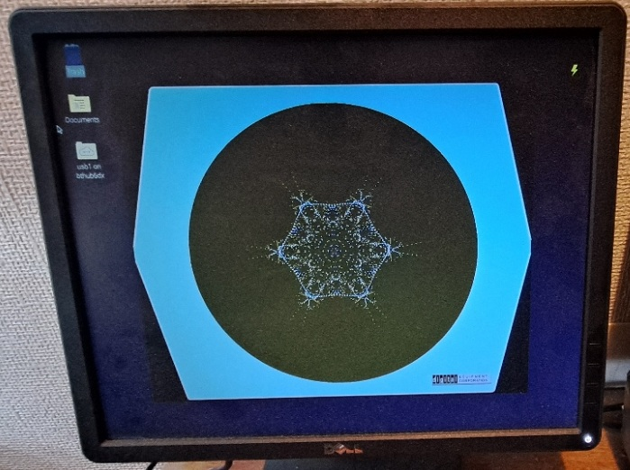
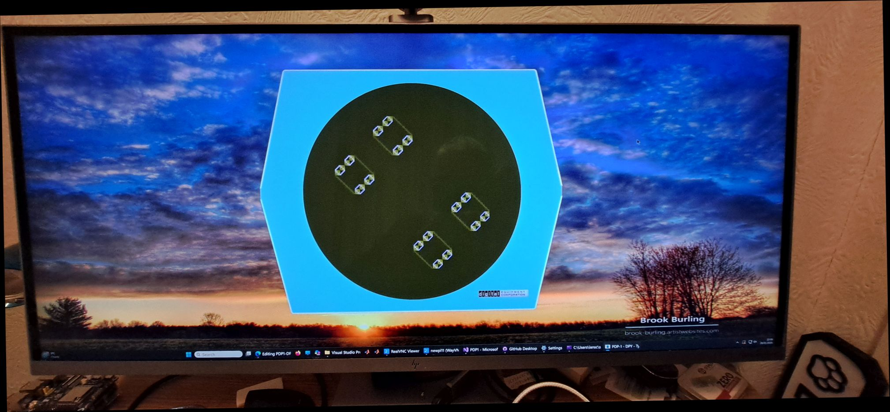

# PDP1-Dpy-SDL2
A Type 30 display for the PiDP1
This is a Linux app tested under Raspbian Bookworm running on a Raspbery Pi 3B.
It is based upon Simh and contains only the relevant files to build a pdp1 simh app.
It is intended as an optional Type 30 display for the PiDP1 (real hardware or virtual).
I have set this app up to display on a cheap and cheerful 1280x1024 display:
The graphics system (SDL2) is the same as that used for the PiDP11 and the GT40 display system that may be used with the PiDP10.
This app will attach to port 3400 on the PiDP1 system as does Angelo's P7 Sim display. 

1. Clone this repo:
git clone https://github.com/Isysxp/PDP1-Dpy-SDL2.git
2. Install SDL2 on your pi:
sudo apt install libsdl2dev
3. In the PDP1-Dpy_SDL2 directory:
make pdp1
4. Run the app, in the BIN directory type:
./pdp1
4. Start the PiDP1 machine in 'apps' mode (see the instructions in the handbook).
5. Close the P7 sim window as we will be using the pdp1-dpy app for the display
6. Start you favourite app on the PiDP1 machine eg dpys5-demo.rim
7. At the sim prompt on the display machine: 
sim> set dpy ena 
sim> att dpy pidp1 (where pidp1 is the name of your PiDP1 machine) 
And you should see: 
 
The first thing you may note is that to Type 30 graphic has 4 black corners around the actual screen.
This is becasue SDL2 does not support per pixel transparency.
One option to fix this is to change the window background to black as I have done for the example image above.
The other alternative is if you simply must have a display like this: 
 
Then you will need the SDL3 version of this app and a much bigger monitor!
This image is of my Windows machine running at 5120x2160 (150%).
To build this, the options are to use the Visual Studio app which includes the SDL3 libraries. 
SDL3 version: https://github.com/Isysxp/PDP1-DPY
Or, install SDL3 yourself into Raspbian Bookworm or Trixie and folow the instructions in the SDL3 repo as above.
Needless to say, this can get a bit involved and you may also have to change the desktop window manager to xfwm4.
The reason for this is that the wayland compositor does not directly support per pixel transparency on the Pi5 using the default Raspbian image.
But, it does work on a Pi4 which I find slightly surprising. 
Info would suggest that it is something to do with the kms driver???? 
NB One thing that may occur is that the newtworking can get in a bit of a knot and can bring the PiDP1 app to a halt. 
I haven't found out the cause of this as yet..... 
 
Ian Schofield Jan 2026 

 

